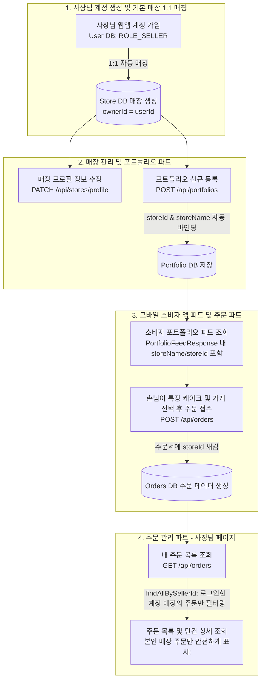
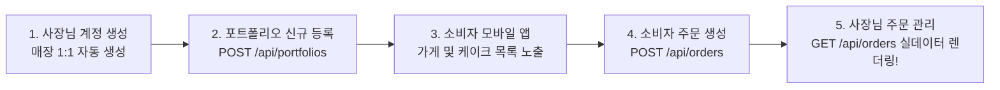

# MakeAWish 통합 데이터 아키텍처 및 팀 협업 동기화 가이드 (2026-07-30)

> 본 문서는 MakeAWish 서비스의 **[사장님 계정 ↔ 매장(Store) ↔ 포트폴리오 ↔ 소비자 모바일 앱 ↔ 주문 관리 시스템]** 간의 통합 데이터 매커니즘, 트러블슈팅 사례, 그리고 팀 파트별 Action Item을 정의한 종합 기술 가이드입니다.

---

## 1. 통합 데이터 환경 및 사장님 계정-매장-주문 매칭 메커니즘 (Multi-Tenant Architecture)
MakeAWish는 다수의 사장님(SELLER)이 각각 본인의 가게와 주문을 독립적으로 관리할 수 있도록 **1:1:N 멀티테넌트 식별 매칭(Identity Mapping)** 아키텍처를 따릅니다.



### 💡 핵심 기술 원리 (Backend DTO 및 필터링 검증 완료)
1. **매장 개설 API가 별도로 없는 이유**:
   - 사장님이 웹앱에서 구글 계정 등으로 가입(`ROLE_SELLER`)하면, 백엔드 서버가 DB에 사장님 소유의 **기본 매장(Store) 1개**를 자동으로 생성합니다.
   - 따라서 매장 개설 버튼 대신 **`PATCH /api/stores/profile` (매장 프로필 정보 수정)** API로 이름, 영업시간, 소개글을 가꾸는 방식입니다.
2. **포트폴리오 업로드 시 매장 정보 연계 (`PortfolioFeedResponse`)**:
   - 포트폴리오 등록(`POST /api/portfolios`) 시 해당 케이크 디자인이 로그인한 사장님의 `Store` 및 `Product`와 바인딩됩니다.
   - 모바일 소비자 앱에서 피드를 조회할 때 내려가는 응답 DTO(`PortfolioFeedResponse`)에 케이크 이미지(`imageUrl`)뿐만 아니라 **가게 이름(`storeName`)과 가게 고유 ID(`storeId`)가 한 세트로 주입**됩니다.
3. **가게별 주문 격리 조회 (`OrderService.getMyOrders`)**:
   - 소비자가 모바일 앱에서 특정 가게의 포트폴리오를 선택해 주문(`POST /api/orders`)하면, 해당 주문에 `storeId`가 새겨집니다.
   - 사장님이 로그인하여 주문 목록(`GET /api/orders`) 및 단건 상세(`GET /api/orders/{orderId}`)를 호출하면 백엔드 로직(`findAllBySellerId`, `AccessDeniedException`)이 **현재 로그인한 사장님 계정의 가게에 들어온 주문만 필터링하여 제공**하므로 타 매장 데이터 노출 위험이 **0%**입니다.

---

## 2. 전체 서비스 선행 작업 흐름 및 현재 진행 상황 (Prerequisite Dependency)



- **현재 상황 분석**:
  - 주문 관리 파트(5번 단계)는 목록 및 단건 상세 조회 API(`GET /api/orders`, `GET /api/orders/{id}`)의 프론트엔드 연동을 완료했습니다.
  - 현재 2번 단계(포트폴리오/매장 관리 파트)가 프론트엔드 실서버 연동 진행 중이므로, 소비자 앱(3~4번 단계)을 통한 실제 DB 주문 생성이 발생하지 않아 조회 시 빈 배열(`[]`)이 반환되는 상태입니다.
- **방어 로직 구축 완료**:
  - 선행 데이터 부재 시에도 화면 검증이 가능하도록, 빈 배열 조회 시 **핵심 4건 Mock 카드(`PENDING`, `ACCEPTED`, `IN_PROGRESS`, `COMPLETED`)를 안전하게 렌더링하는 Fallback 방어 메커니즘**을 탑재했습니다.

---

## 3. 트러블슈팅 및 방어 시스템 구축 사례 (Troubleshooting Log)

```mermaid
flowchart LR
    subgraph P1 [이슈 1: 400 Bad Request 에러]
        A1[문자열 Mock ID 'order_004' 요청] -->|BE Long 변환 실패| B1[서버 400 에러 발생]
        B1 -->|해결| C1[isMockOrderId 방어 로직 탑재<br>Mock ID는 실서버 호출 차단 & 로컬 데이터 렌더링]
    end

    subgraph P2 [이슈 2: useEffect is not defined 크래시]
        A2[OrderDetail.jsx 상단 import 누락] -->|Hook 실행| B2[화면 흰색 크래시]
        B2 -->|해결| C2[import useState, useEffect 명시<br>화면 렌더링 완벽 정상화]
    end

    subgraph P3 [이슈 3: NaN 및 toLocaleString TypeError]
        A3[null/undefined 금액 응답] -->|수식 계산| B3[화면 멈춤 위험]
        B3 -->|해결| C3[Number price || 0 방어 연산<br>어떤 데이터에도 안전한 UI 보장]
    end

    subgraph P4 [이슈 4: 구형 캐시 데이터 간섭 현상]
        A4[Zustand localStorage.cake-orders] -->|과거 12개 캐시 보존| B4[새 코드 초기값 덮어씀]
        B4 -->|해결| C4[Zustand 공식 version: 2 적용<br>구형 캐시 자동 만료 & 4건 클린 리셋]
    end
```

---

## 4. 실서버 연동 검증 전략 (Testing Strategy)
다른 파트의 화면이 병합되기 전에도 실서버 DB 연동을 100% 검증할 수 있는 투트랙 전략입니다.

1. **기본 화면 검증 (Mock Fallback 모드)**:
   - 현재 브라우저(`http://localhost:5173/orders`) 접속 시 실서버 통신(`200 OK`) 후 DB가 비어있으면 4건 핵심 Mock 카드가 자동 출력됩니다.
   - 이를 통해 각 상태별 UI, 단건 상세 이동, `LocalDateTime` 분할 파싱, 천단위 콤마 포맷팅을 400 에러 없이 완벽히 검증할 수 있습니다.
2. **실데이터 DB 통신 검증 (Swagger / Postman 모드)**:
   - 백엔드의 **Swagger API 문서** 또는 **Postman**에서 `POST /api/orders`를 1회 실행하여 **[현재 테스트 중인 사장님 계정의 가게 ID]** 앞으로 테스트 주문 1건을 생성합니다.
   - 즉시 프론트엔드 새로고침 시 Mock 카드가 사라지고, 방금 DB에 입력된 진짜 주문 1건이 화면에 렌더링되는 실시간 연동을 증명할 수 있습니다.

---

## 5. 팀 파트별 Action Item (To-Do List by Role)

### 🙋‍♂️ 1. 주문 관리 파트 담당자 (FE)
1. **현재 브랜치(`feat/order-list-api`) Merge 진행**:
   - 타 파트 파일 및 공통 파일을 수정하지 않은 독립 모듈(`src/api/orderApi.js`)이므로 충돌 가능성 0% 상태에서 안전하게 병합.
2. **타 파트 PR 합류 시 공통 파일 안전 감사(Audit) 및 병합 지원**:
   - `src/api/client.js`, `src/App.jsx`, `src/store/useAuthStore.js` 건드린 로직 유무 점검.
3. **다음 액션 브랜치(`feat/order-status-api`) 착수**:
   - `OrderDetail.jsx` 내 **[주문 수락 / 거절 / 제작중 / 픽업완료]** 상태 변경 버튼 실서버 연동 (`PATCH /api/orders/{orderId}/status`)
   - `OrderDetail.jsx` 내 **[추가금 책정/등록]** 입력 폼 실서버 연동 (`POST /api/orders/{orderId}/extra-fee`)

### 🖥️ 2. 백엔드 파트 담당자 (BE)
1. **명세서(Notion 표) 상태 최신화**:
   - **`주문 상세 조회 (GET /api/orders/{orderId})`**: 백엔드 `OrderController.java`에 구현 및 실서버 배포 완료되어 있으므로 **`[BE: 완료 🟢]`**, **`[FE: 완료 🟢]`**로 변경.
2. **(선택) 실서버 DB 연동 검증 지원**:
   - 소비자 앱 연동 이전 실데이터 조회 검증을 위해, 프론트 테스트 사장님 계정의 가게 ID로 `POST /api/orders` 테스트 주문 1건 생성 지원.

### 🎨 3. 매장 및 포트폴리오 관리 파트 담당자 (FE)
1. **안심 합류 안내 및 커밋 Push / PR 요청**:
   - **`포트폴리오 신규 등록 (POST /api/portfolios)`**이 DB에 반영되어야 소비자 앱 목록 노출 및 주문 생성 전체 사이클이 완성되므로, 로컬 작업본을 원격 브랜치에 Push 및 PR 생성 요청.
   - 주문 관리 파트와 파일이 전혀 겹치지 않아 충돌 위험이 없으므로 심리적 안전망 보장 및 병합 지원.
